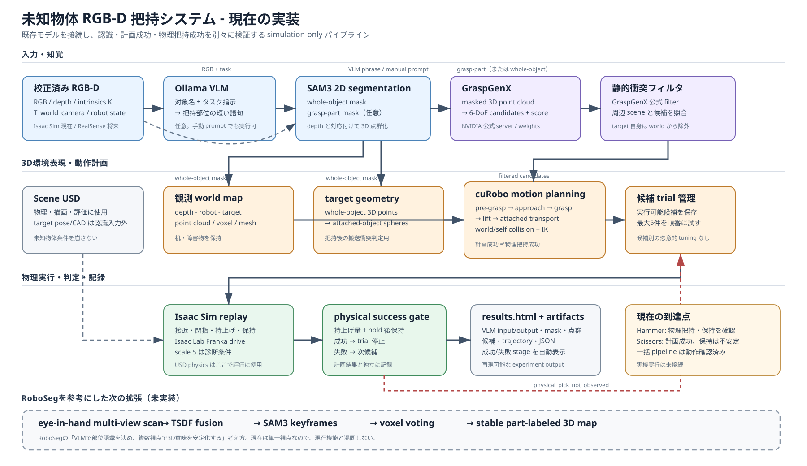

# System pipeline diagram

The diagram separates the implemented single-view simulation pipeline from the
future multi-view semantic reconstruction extension inspired by RoboSeg.

Current implementation boundaries:

- Scene USD is used for Isaac Sim rendering, physics, and evaluation. Target
  CAD, authored target pose, and simulator semantic ground truth are not passed
  into grasp perception or cuRobo planning.
- The whole-object SAM3 mask removes the intended target from the observed
  collision map and constructs attached-object geometry. The optional
  grasp-part mask constrains GraspGenX candidate generation.
- GraspGenX proposal score, collision-aware cuRobo planning success, and Isaac
  physical-pick success are separate gates.
- A failed physical replay advances to the next executable candidate, up to the
  same configured maximum for every run. Candidate-specific parameter tuning is
  not performed.
- Finger-drive scale 5 is a simulation diagnostic, not a hardware-calibrated
  grasp-force setting.

RoboSeg is used as architectural context rather than copied implementation. Its
VLM-to-SAM3 functional-part front end and part-labeled 3D map motivate the
dashed future lane. RoboSeg uses eye-in-hand multi-view TSDF fusion, keyframe
SAM3 inference, voxel voting, AnyGrasp, and MoveIt-compatible execution; this
project currently uses calibrated single-view RGB-D, GraspGenX, cuRobo, and
Isaac Sim physical replay.
